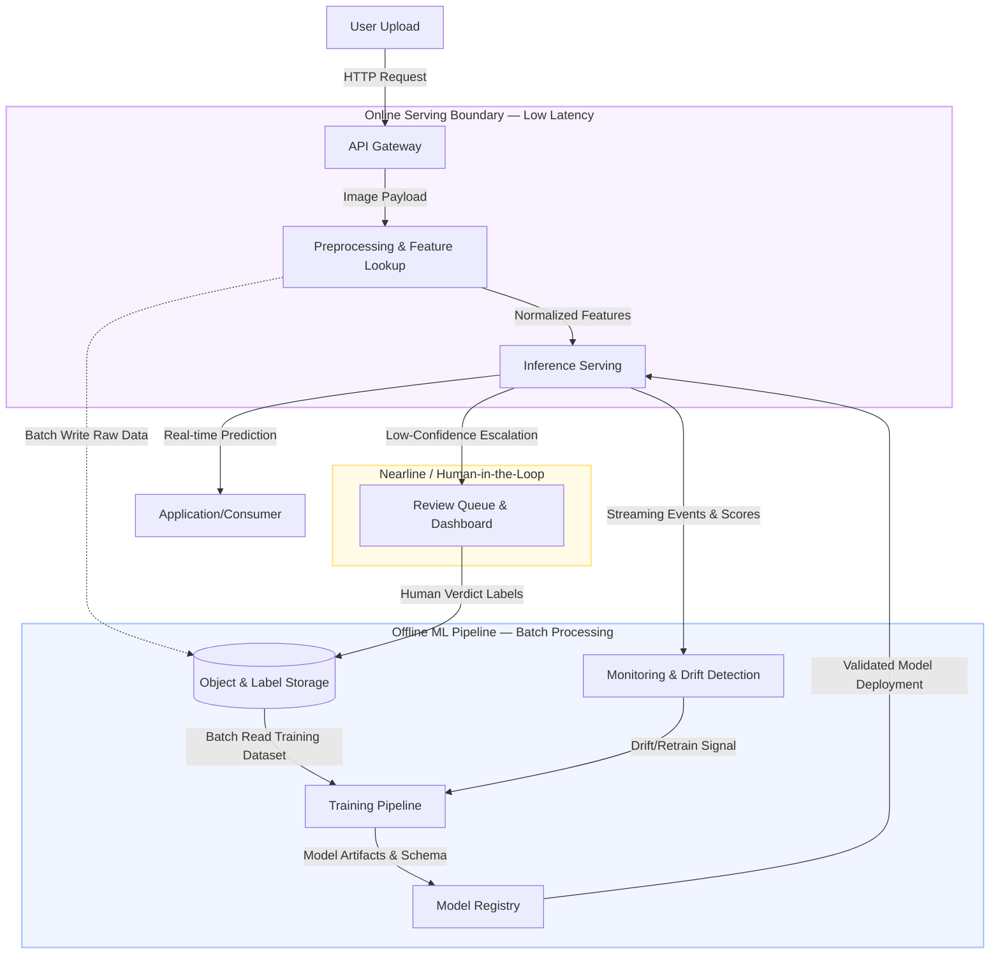

# Image Moderation Architecture

```mermaid
flowchart TB
    %% Definitions of Boundaries
    subgraph ONLINE_SERVING [Online Serving Boundary — Low Latency]
        A[API Gateway]
        B[Preprocessing & Feature Lookup]
        C[Inference Serving]
    end

    subgraph NEARLINE [Nearline / Human-in-the-Loop]
        G[Review Queue & Dashboard]
    end

    subgraph OFFLINE_ML_PIPELINE [Offline ML Pipeline — Batch Processing]
        D[(Object & Label Storage)]
        E[Monitoring & Drift Detection]
        F[Training Pipeline]
        H[Model Registry]
    end

    %% Online Flows
    Inbound[User Upload] -->|HTTP Request| A
    A -->|Image Payload| B
    B -->|Normalized Features| C
    C -->|Real-time Prediction| Outbound[Application/Consumer]

    %% Storage & Edge Cases (The Feedback Triggers)
    B -.->|Batch Write Raw Data| D
    C -->|Streaming Events & Scores| E
    C -->|Low-Confidence Escalation| G
    G -->|Human Verdict Labels| D

    %% The Offline Feedback Loop
    D -->|Batch Read Training Dataset| F
    E -->|Drift/Retrain Signal| F
    F -->|Model Artifacts & Schema| H
    H -->|Validated Model Deployment| C

    %% Styling
    style ONLINE_SERVING fill:#f9f3ff,stroke:#d3adf7,stroke-width:2px
    style NEARLINE fill:#fffbe6,stroke:#ffe58f,stroke-width:2px
    style OFFLINE_ML_PIPELINE fill:#f0f5ff,stroke:#adc6ff,stroke-width:2px
```